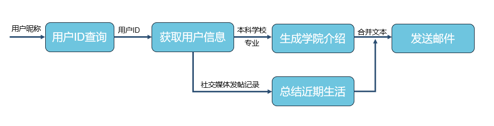
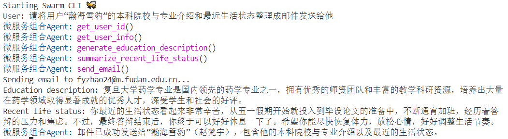
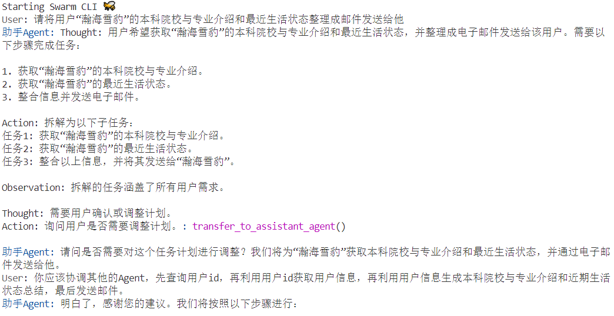
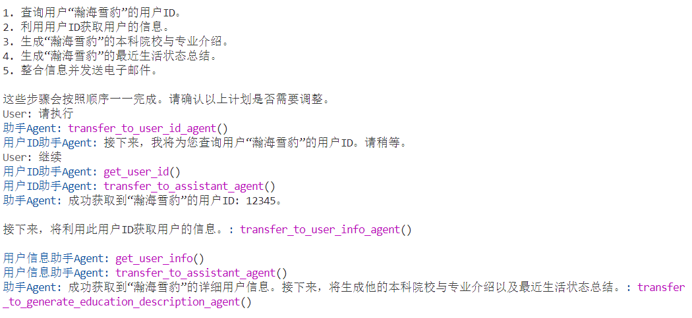
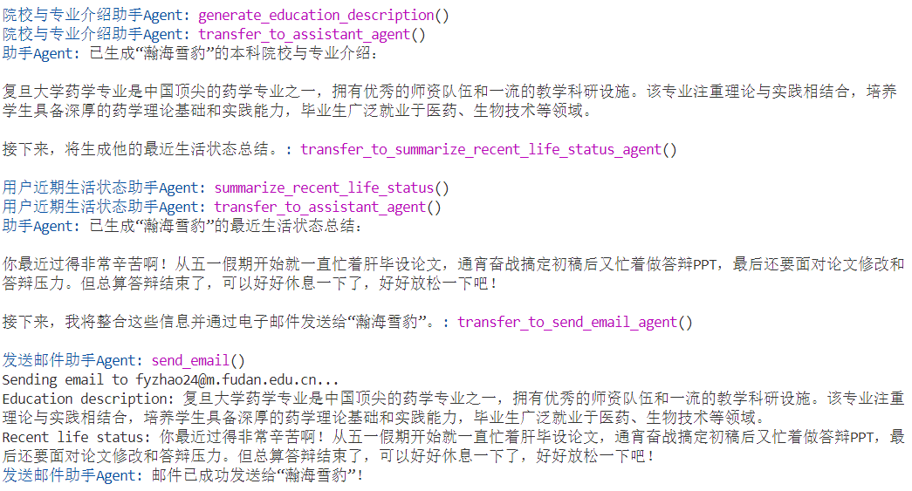

# LLM Agent模拟微服务组合

## 介绍
一个使用LLM Agent模拟微服务组合的例子。

**场景介绍**：根据用户需求，自动从已注册的微服务中选择合适的微服务组合，以实现微服务组合仿真验证。在该例子中，我们注册了7个微服务。我们设定的需求需要从这7个微服务中选择5个微服务按照恰当的方式组合完成。

**需求**：给定用户昵称，生成用户本科院校与专业介绍和近期生活状态总结，并发送邮件给用户。

**实现方式**：使用LLM Agent模拟微服务组合。有三种实现方式：
1. Autonomous Agent: 单个Agent完成所有任务
2. Cooperate Agents: 每个Agent负责一个微服务，多个Agent在一个中枢Agent的协调下协作完成任务
3. Simulation Agents: 每个Agent负责一个微服务，没有中枢Agent，多个Agent自主协调完成任务（TODO）

**预期工作流**：



## 定义工具函数（模拟微服务）
| 函数名                      | 功能描述                                           | 输入                  | 输出                          |
|-----------------------------|----------------------------------------------------|-----------------------|-------------------------------|
| `get_user_id`               | 根据给定的昵称获取用户ID                           | 用户昵称              | 包含用户ID的JSON字符串        |
| `get_user_info`             | 根据给定的用户ID获取用户信息                       | 用户ID                | 包含用户详细信息的JSON字符串  |
| `generate_education_description`     | 根据学校名称与专业名称，生成院校与专业的介绍       | 学校名称、专业名称    | 院校与专业的自然语言描述        |
| `summarize_recent_life_status` | 根据用户的帖子历史，总结用户的近期生活状态       | 用户的帖子历史        | 用户近期生活状态的自然文本描述|
| `send_email`                | 根据用户画像和近期生活状态，发送邮件给用户         | 用户的电子邮件地址、用户画像、近期生活状态 | 发送邮件的状态信息    |
| `get_weather`               | 根据给定的地点和时间，获取当前的天气信息           | 地点和时间            | 包含天气信息的JSON字符串      |
| `calculate`                 | 对给定的表达式进行求解                             | 数学表达式            | 计算结果                      |

## 运行
```bash
python run.py
```

## 运行时终端的User输入
1. Autonomous Agent：
    ```
    请将用户“瀚海雪豹”的本科院校与专业介绍和最近生活状态整理成邮件发送给他
    ```
2. Cooperate Agents：
    ```
    请将用户“瀚海雪豹”的本科院校与专业介绍和最近生活状态整理成邮件发送给他
    
    你应该协调其他的Agent，先查询用户id，再利用用户id获取用户信息，再利用用户信息生成本科院校与专业介绍和近期生活状态总结，最后发送邮件。
    ```
3. Simulation Agents：
    ```
    TODO
    ```

## 结果

1. Autonomous Agent：

    

2. Cooperate Agents：

    

    

    

3. Simulation Agents：

    TODO

## 成本

| 实现方式 | 成本 |
|--------|------|
| Autonomous Agent | $0.02 - $0.03 |
| Cooperate Agents | $0.08 - $0.10 |
| Simulation Agents | TODO |

