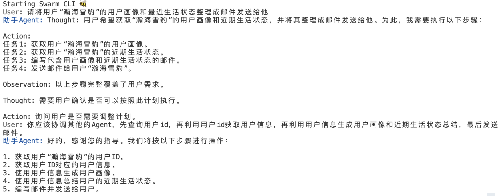
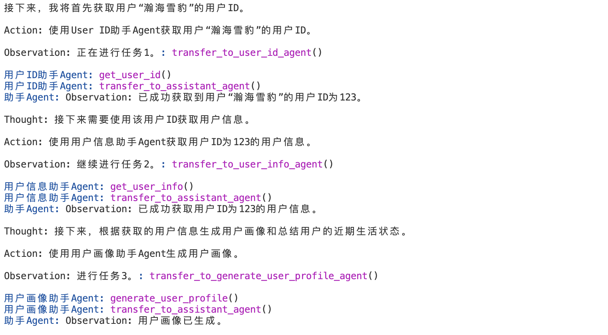
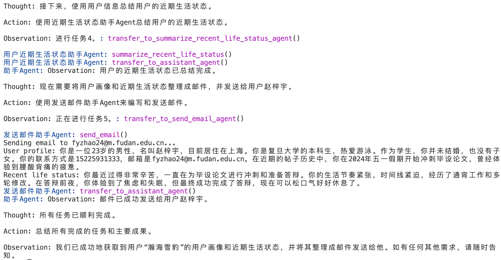

# 多智能体协作进行服务组合的例子

预期工作流：


## 定义工具函数（模拟微服务）
| 函数名                      | 功能描述                                           | 输入                  | 输出                          |
|-----------------------------|----------------------------------------------------|-----------------------|-------------------------------|
| `get_user_id`               | 根据给定的昵称获取用户ID                           | 用户昵称              | 包含用户ID的JSON字符串        |
| `get_user_info`             | 根据给定的用户ID获取用户信息                       | 用户ID                | 包含用户详细信息的JSON字符串  |
| `generate_user_profile`     | 根据用户信息生成用户画像的自然文本描述             | 包含用户信息的字典    | 用户画像的自然文本描述        |
| `summarize_recent_life_status` | 根据用户的帖子历史，总结用户的近期生活状态       | 用户的帖子历史        | 用户近期生活状态的自然文本描述|
| `send_email`                | 根据用户画像和近期生活状态，发送邮件给用户         | 用户的电子邮件地址、用户画像、近期生活状态 | 发送邮件的状态信息    |
| `get_weather`               | 根据给定的地点和时间，获取当前的天气信息           | 地点和时间            | 包含天气信息的JSON字符串      |
| `calculate`                 | 对给定的表达式进行求解                             | 数学表达式            | 计算结果                      |

## 运行
```bash
python run.py
```

## User需求描述
请将用户“瀚海雪豹”的用户画像和最近生活状态整理成邮件发送给他
你应该协调其他的Agent，先查询用户id，再利用用户id获取用户信息，再利用用户信息生成用户画像和近期生活状态总结，最后发送邮件。

## 结果




## 成本
示例开销约为$0.08