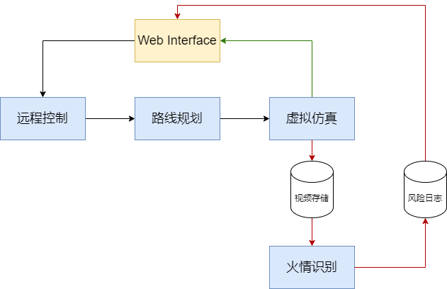
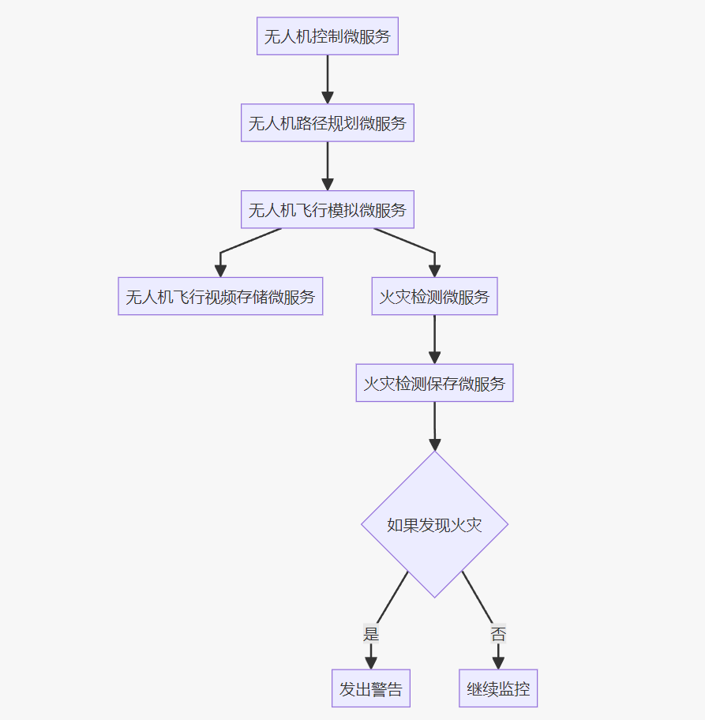

# LLM Agent模拟微服务组合-无人机demo

## 介绍
一个使用LLM Agent模拟微服务组合的例子。

**场景介绍**：根据用户需求，自动从已注册的微服务中选择合适的微服务组合，以实现微服务组合仿真验证。该例子中包含5个与无人机相关的微服务。

**需求**：1.用户首先通过无人机控制服务和路径规划服务得到无人机飞行路线，再利用控制无人机仿真环境中按照规划后的路径进行飞行 2.仿真环境中无人机的实时视频画面会存储在数据库中，并被用于目标识别以检测火灾，检测的结果会被存储在数据库中，如果识别到火灾则发出警告。

**实现方式**：使用LLM Agent模拟微服务组合。
1. Cooperate Agents: 每个Agent负责一个微服务，多个Agent在一个中枢Agent的协调下协作完成任务

**预期工作流**：



## 定义工具函数（模拟微服务）
| 函数名 | 功能描述 | 输入 | 输出 |
|--------|----------|------|------|
| `uav_control` | 获取无人机的起飞点、目的地和途径点 | 无 | 包含起飞点、目的地和途径点坐标的JSON字符串 |
| `uav_path_planning` | 规划无人机飞行路径，计算最短路径 | 起飞点坐标、目的地坐标、途径点坐标列表 | 包含最短路径和最短距离的JSON字符串 |
| `uav_simulation` | 模拟无人机飞行过程 | 飞行路线坐标点列表 | 包含当前飞行点坐标和视频帧的JSON字符串 |
| `save_video_frame` | 保存视频帧到数据库 | base64编码的视频帧 | 包含保存状态和视频帧的JSON字符串 |
| `fire_detection` | 检测视频帧中是否存在火灾 | base64编码的视频帧 | 包含火灾检测结果的JSON字符串 |
| `save_fire_detection` | 保存火灾检测结果到数据库 | 火灾检测结果（布尔值） | 包含火灾检测结果的JSON字符串 |
| `exit_script` | 结束与用户的交互 | 无 | 无 |

## 运行

1. 使用`Gradio` 可视化运行
```bash
python app.py
```

## 运行时输入示例

```
目前有哪些已注册的微服务？

我希望利用已注册的微服务进行组合，以构建一个无人机app。该app主要包含两个功能：1.用户首先通过无人机控制服务和路径规划服务得到无人机飞行路线，再利用控制无人机仿真环境中按照规划后的路径进行飞行 2.仿真环境中无人机的实时视频画面会存储在数据库中，并被用于目标识别以检测火灾，检测的结果会被存储在数据库中，如果识别到火灾则发出警告.

我们假定用户在调用无人机控制服务时输入的起始坐标为(31.3385, 121.5020)，终点坐标为(31.3389, 121.5025)，设定的途经点为(31.3384, 121.5019), (31.3387, 121.5018)和 (31.3384, 121.5023)

请你根据以上的微服务组合逻辑，使用mardown的mermaid语法画出框架图，框架图中的节点应该是微服务的名称。
```

## 结果

